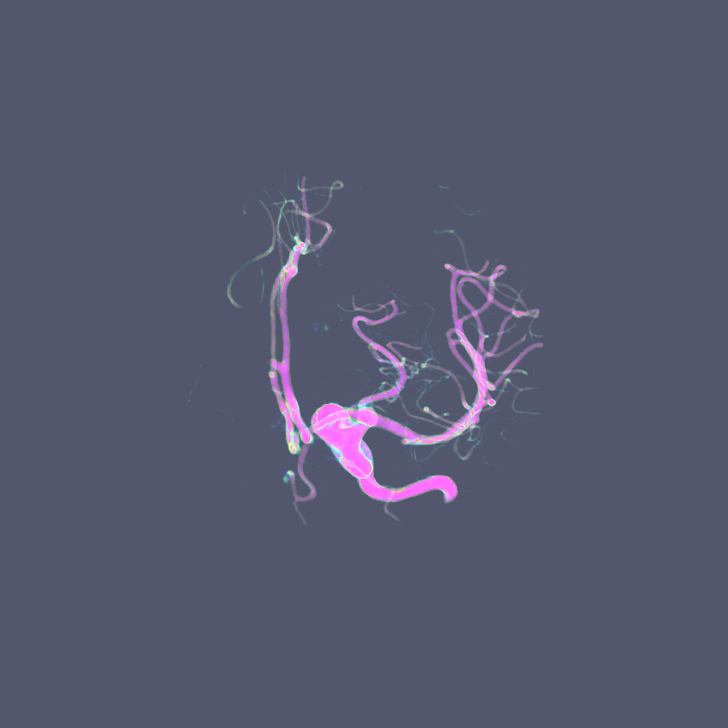
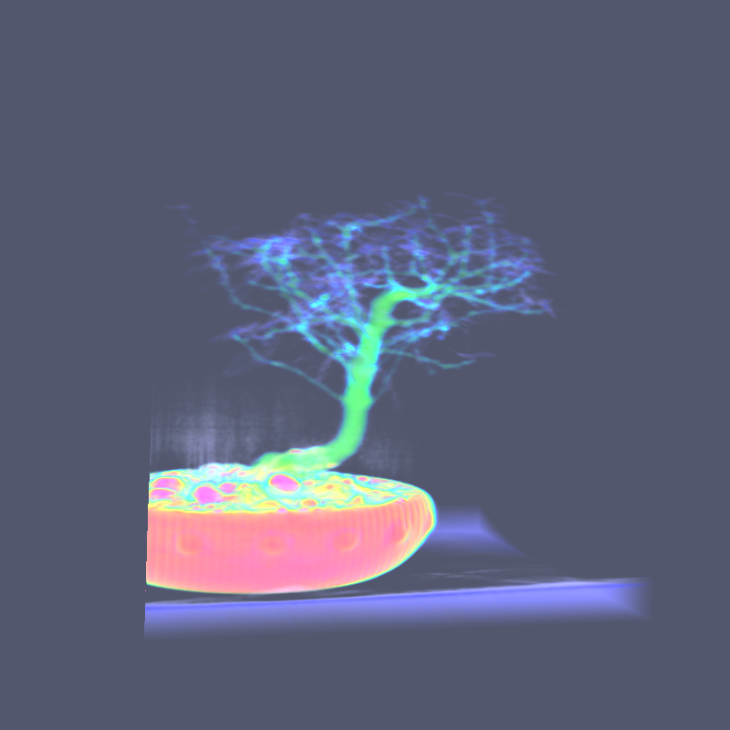

# opengl-directVolumeRenderer

It's a small tool for direct volume rendering, implemented by C++.

+ OpenGL(glad & glfw-3.3.2)
+ glm 0.9.9
---
## compilation

Well, no CMakeLists.txt or make file, just use [Mingw-w64](http://www.mingw-w64.org/doku.php) to compile plz.

## Data Format

### \*.raw file

\*.raw file is a binary file, which is only consists of the sampling value of the original 3D scalar field, total X×Y×Z values. The sequence of the data is arranged in the order of X, than Y and finally Z. It **doesn't** contain any information about resolution and spacing distance.

### \*.dat file

Every raw data file (\*.raw) should be equipped with a data-description file (\*.dat), which describes the basic info of \*.raw file, is consisted of following items:

+ `ObjectFileName`: indicates the path of corresponding \*.raw
+ `TaggedFileName`: empty, unknown
+ `Resolution`: X, Y, Z, marks the sampling points along each direction
+ `SliceThickness`: marks the space between adjacent two sampling points in each direction
+ `Format`: the type of the data, described as following table:

keyword | UCHAR | CHAR | USHORT | SHORT | UINT | INT | ULLONG | LLONG
:--: | :--: | :--: | :--: | :--: | :--: | :--: | :--: | :--:
type | `uint8_t` | `int8_t` | `uint16_t` | `int16_t` | `uint32_t` | `int32_t` | `uint64_t` | `int64_t`

keyword  | FLOAT | DOUBLE | LDOUBLE
:--: | :--: | :--: | :--:
type | `float` | `double` | `long double`

For example, the pair of data:
+ [bonsai.raw]([gallery/bonsai.png](http://cdn.klacansky.com/open-scivis-datasets/bonsai/bonsai_256x256x256_uint8.raw)) (256×256×256，uint8，16.0 MB)

and the corresponding description file bonsai.dat is

```txt
ObjectFileName: bonsai_256x256x256_uint8.raw
TaggedFileName: ---
Resolution:  256  256  256
SliceThickness: 1.0 1.0 1.0
Format:         UCHAR
```

## ChangeLog

### Version 0.1.1
+ Basic rendering pipeline

## gallery

1. [aneurism](http://cdn.klacansky.com/open-scivis-datasets/aneurism/aneurism_256x256x256_uint8.raw) (256×256×256，uint8，16.0 MB) 
2. [bonsai]([gallery/bonsai.png](http://cdn.klacansky.com/open-scivis-datasets/bonsai/bonsai_256x256x256_uint8.raw)) (256×256×256，uint8，16.0 MB) 

## Future work

+ Mouse controller
+ Cutting-edge techniques for volume rendering (maybe)
+ Resources manager (maybe)

## To Be Continue...